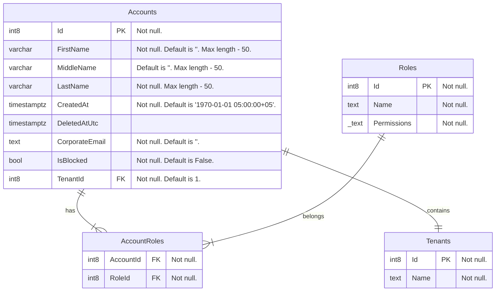

# TourmalineCore.AccountsApi

## Launch docker containers

1. You need to create an internal network for configuring interaction between different back-end services.  
You can do it using the following command in your terminal: `docker network create ic-backend-deb`.  
Note: If you already has this network, skip this step.

2. Execute the command `docker-compose up -d` from source folder

## Configurations

- MockForPullRequest - used in PR pipeline to run the service in isolation (no external deps) and run its Karate tests against it
- MockForDevelopment - used locally when you run the service in Visual Studio e.g. in Debug and don't want to spin up any external deps
- LocalEnvForDevelopment - used locally when you run the service in Visual Studio and you want to connect to its external deps from Local Env
- ProdForDevelopment - used locally when you run the service in Visual Studio and want to connect to its external deps from Prod specially dedicated Local Development Tenant
- ProdForDeployment - used when we run the service in Prod, it shouldn't contain any secrets, it should be a Release build, using real Prod external deps

## Database scheme 

