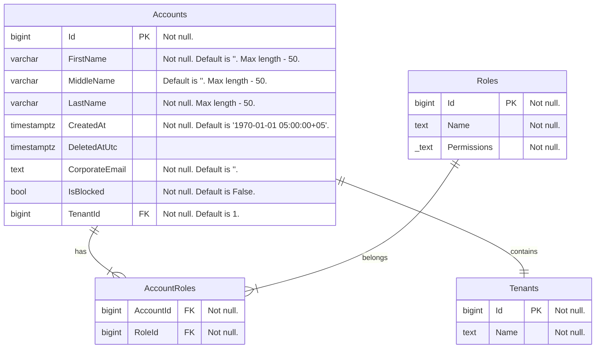

# accounts-api

## Table of contents

- [accounts-api](#accounts-api)
  * [Brief description](#brief-description)
  * [Launch docker containers](#launch-docker-containers)
  * [Configurations](#configurations)
  * [Database scheme](#database-scheme)

## Brief description

API service that works with information about accounts registered in the system. 
Each account is attached to a tenant in the system according to multi-tenancy approach. An account can have a role, permissions are attached to the role.

## Launch docker containers

1. You need to create an internal network for configuring interaction between different back-end services.  
You can do it using the following command in your terminal: `docker network create ic-backend-deb`.  
Note: If you already has this network, skip this step.

2. Execute the command `docker-compose up -d` from source folder

## Configurations

- MockForPullRequest - used in PR pipeline to run the service in isolation (no external deps) and run its Karate tests against it
- MockForDevelopment - used locally when you run the service in Visual Studio e.g. in Debug and don't want to spin up any external deps
- LocalEnvForDevelopment - used locally when you run the service in Visual Studio and you want to connect to its external deps from Local Env
- ProdForDevelopment - used locally when you run the service in Visual Studio and want to connect to its external deps from Prod specially dedicated Local Development Tenant
- ProdForDeployment - used when we run the service in Prod, it shouldn't contain any secrets, it should be a Release build, using real Prod external deps

## How add new migration

When you have made all the changes and are ready to add new migration, you need to follow these steps

1. You need to run db in docker, using command

```
docker compose --profile db-only up -d
```

### for MacOS

2. Then add new migration, using the following command and dont forget to change `YourNewMigrationName`

```
dotnet ef migrations add YourNewMigrationName --startup-project Api/ --project DataAccess/ -- --environment MockForDevelopment
```

3. After adding your new migration you need to update db, using the following command

```
dotnet ef database update --startup-project Api/ --project DataAccess/ -- --environment MockForDevelopment
```

4. If you want to remove `last` migration, use the following command

```
dotnet ef migrations remove --startup-project Api/ --project DataAccess/ -- --environment MockForDevelopment
```

### for Windows

#### TODO: Most likely it will be so, but it is necessary to check on Windows the correctness of the work and if something is wrong here, then correct the README

2. Then add new migration, using the following command and dont forget to change `YourNewMigrationName`

```
dotnet ef migrations add YourNewMigrationName -- --environment MockForDevelopment
```

3. After adding your new migration you need to update db, using the following command

```
dotnet ef database update -- --environment MockForDevelopment
```

4. If you want to remove `last` migration, use the following command

```
dotnet ef migrations remove -- --environment MockForDevelopment
```

## Database scheme 


